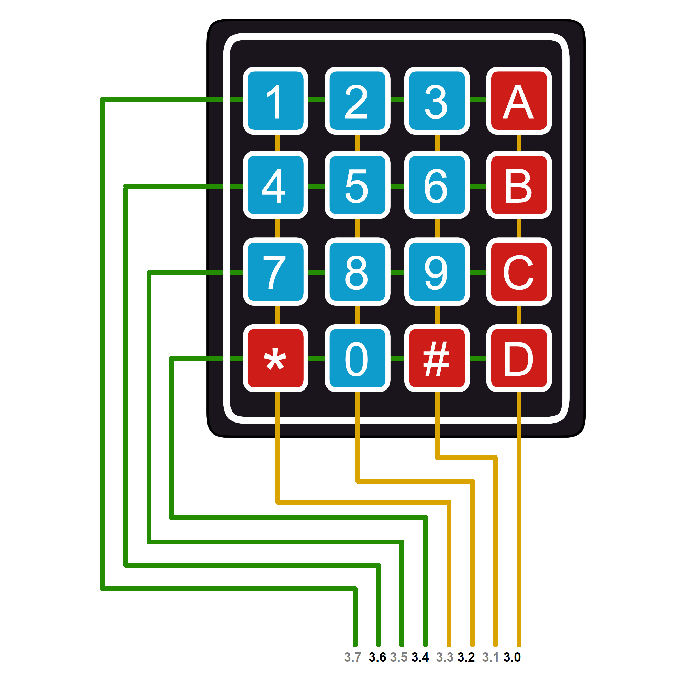
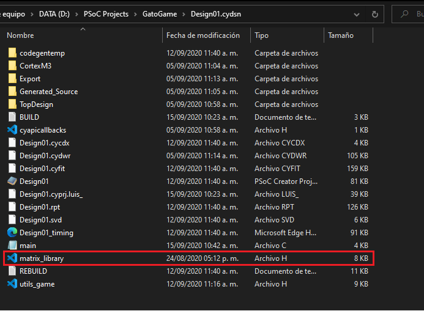
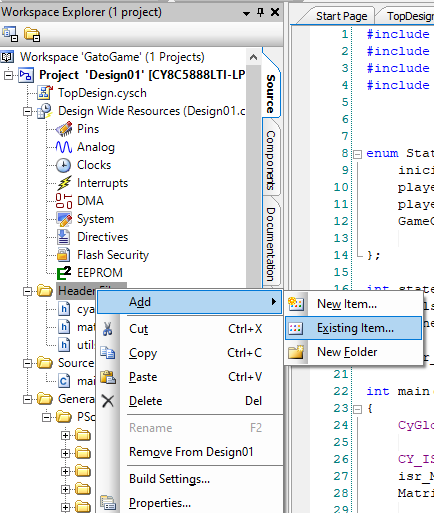
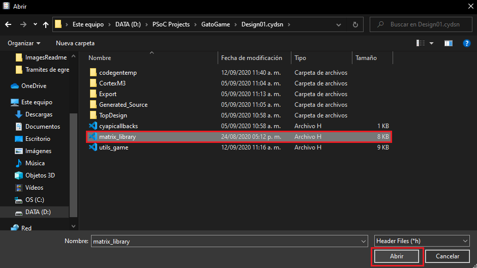
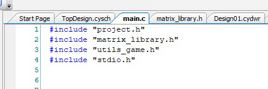
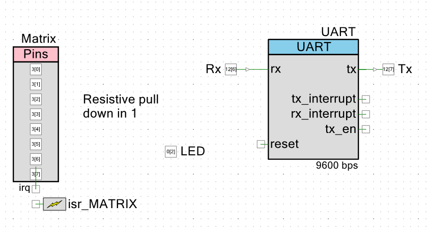

# Matrix-keyboard-PSoC-5lp

## Brief description
This PSoC 5 library allows you to read the matrix keyboard reading just digits ('1', 'A', etc) or a combination of digits  ('1997', 'A10B')

This library is a summary function to read a simple Matrix Keyboard 4x4. This allows you to create your PSoC projects without taking care of the low programming logic of reading the buttons of the keyboard. 

So, using the functions that ***matrix_library.h*** provides, you will able to put the focus on your own project which is the important thing. This code is not a professional PSoC library because I wrote that while I was doing a scholar project so. Nevertheles, it is usefull and help me in another PSoC projects.
Finally, if you have another contributions or ideas for these functions,  you are free to extend that and send me a message to update this repository.

## Functions
###### keypad_scan(void)

- **Input**:
  *void*
- **Output**: *This function return in 'key' variable ( which is a global char variable inside this library) the key pressed on the keyboard e.g. if(key=='1'){//someCode}*
- **Description**: *Use 'keypad_scan' function if your matrix is connected directly to the PSoC.*
###### keypad_scanUDB(void)
- **Input**:
  *void*
- **Output**: This function return in 'keyUDB' variable (wich is a global char variable inside this library) the key pressed on the keyboard e.g. if(keyUDB=='1'){//someCode}
- **Description**: Use 'keypad_scanUDB' function instead of keypad_scan, if your matrix is connected to UPY Developer Board which have conditioning circuits.

###### MatrixCheckLoop( component, modo)
- **Inputs**: 
>***component***: This is the component option where the output will be printed ("LCD"/"UART") 
>***modo***: choose the modality of your physical matrix connection. If it is connected directly to PSoC you will need to use keypad_scan, Nevertheless, if this matrix is connected in a special protoboard like is the protoboard of UPY's Emb engineers you will need to use keypad_scanUDB*
- **Output**: *This is a loop! it will print in the component choosed ("LCD"/"UART") the key pressed everytime!*
- **Description**: *Use without interruption just to check the functionality of matricial componet!*

###### keypad_scanLine(ENTER, SIZE , MODO)
- **Inputs**:  
>***ENTER***: it's the final character of the message  
>***SIZE***: The maximun size allowed by digit combination  
>***MODO***: it's the mode of your physical matrix connection  
- **Output**: it will return in keyLine variable (which is a global var in this library) a string message with the convination when user press Enter (#/D/C)
- **Description**: Use this function when you need to get a message or digit convination from Matrix.

## Global variables

###### **key**:  
This global variable store the information read by the matrix keyboard when function  ***keypad_scan()*** is executed

###### **keyUDB**:  
This global variable store the information read by the matrix keyboard when function  ***keypad_scanUDB()*** is executed

###### **keyLine**:  
This global variable store the information read by the matrix keyboard when function  ***keypad_scanLine()*** is executing and Enter is pressed (It will be empty until Enter is pressed).

###### **keyLine_temp**:  
This global variable store the current information read by the matrix keyboard when function  ***keypad_scanLine()*** is executed. This, store characters by character until Enter is not pressed (when this ocurrs  keyLine_temp will be empty).

###### **keyLine_Security**:  
This global variable store the current information read by the matrix keyboard with speacial character **"*"** when function  ***keypad_scanLine()*** is executed. 

## Keyboard Matrix conection

###### Top Design in PSoC Creator
 

 

###### Matrix connection to PSoC 
 

 

## How to implement matrix_library.h on your projects
The important file in this repository is ***matrix_library.h*** file which contains the necessary functions to use the matrix keyboard 4x4. Including the header in your  PSoC project will able to use the functions described above. Furthermore, a PSoC project is added to this repository in case you needed it(***name_example***).
###### Download
To get this library, it will be necessary to clone the repository or download it in a zip file. Then, seek the header and put it inside of the folder Design.cydsn which is created when you do a new workspace whit any name.

###### Adding ***matrix_library.h***  to your current  PSoC workspace project

 

The following image shows how the ***matrix_library.h*** is stored inside of my PSoC project named ***Design01.cydsn*** which has been created when the workspace ***GatoGame*** was created in PSoC creator.

    

Then, it will be necessary to add the header in PSoC Creator as well, you can do it just clicking on ***Header files** -> ***Add*** -> ***Existing Item*** as is showed in the following picture.

###### Importing the header in main.c

For this step, it will be necessary to invoke the library with the ***#include "matrix_library.h"*** because it is a local library.

###### Top Design in PSoC creator

To use ***matrix_library.h*** you must to have on the ***Top Design*** some sort of PSoC componets named as the following names:

>LCD to the LCD module  
>UART to the Uart Module 
>Matrix to the Matrix conection  

It is not necessary to have all components but be careful calling whatever of those components with some names listed above. Look at the example, in the following picture, I used only the Uart module to see my output and as a requirement, it was named ***UART***.

