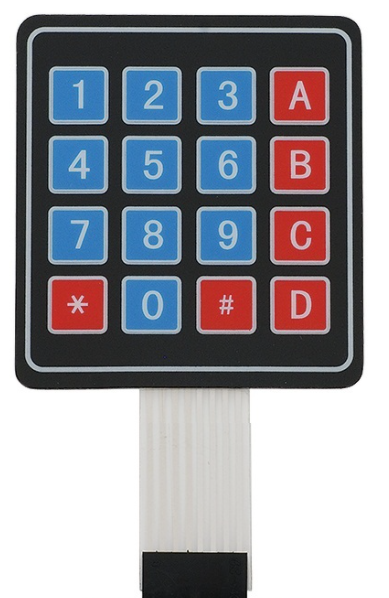
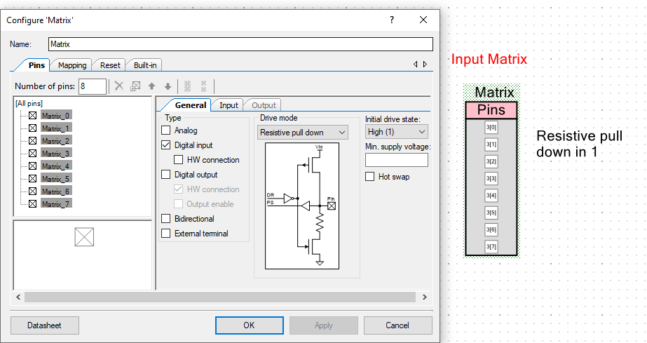
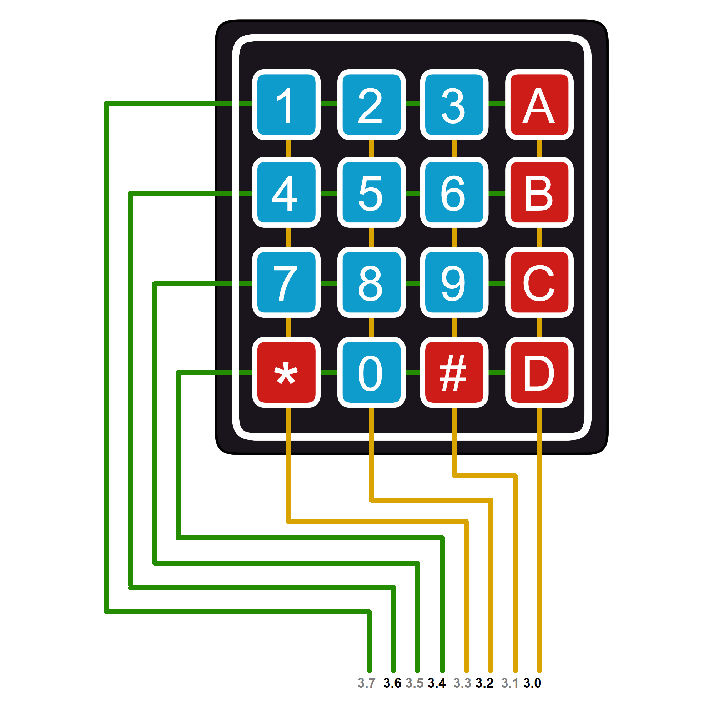

# Matrix-keyboard-PSoC-5lp

## Brief description
This PSoC 5 library allows you to read the matrix keyboard reading just digits ('1', 'A', etc) or a combination of digits  ('1997', 'A10B')

This library is a summary function to read a simple Matrix Keyboard 4x4. This allows you to create your PSoC projects without taking care of the low programming logic of reading the buttons of the keyboard. 

On the other hand, you will able to put the focus on your own project which is the important thing and just using the functions that i provided you. This code is not a professional PSoC library because I wrote that while I was doing a scholar project so. Nevertheles, it is usefull and help me in another PSoC projects.
Finally, if you have another contributions or ideas for these functions,  you are free to extend that and send me a message to update this repository.

## Functions
###### keypad_scan(void)

- **Input**:
  *void*
- **Output**: *This function return in 'key' variable ( which is a global char variable inside this library) the key pressed on the keyboard e.g. if(key=='1'){//someCode}*
- **Description**: *Use 'keypad_scan' function if your matrix is connected directly to the PSoC.*
###### keypad_scanUDB(void)
- **Input**:
  *void*
- **Output**: This function return in 'c_key' variable (wich is a global char variable inside this library) the key pressed on the keyboard e.g. if(c_key=='1'){//someCode}
- **Description**: Use 'keypad_scanUDB' function instead of keypad_scan, if your matrix is connected to UPY Developer Board which have conditioning circuits.

###### MatrixCheckLoop( component, modo)
- **Input**: *   >***component***: This is the component option where the output will be printed ("LCD"/"UART") 
               >***modo***: choose the modality of your physical matrix connection. If it is connected directly to PSoC you will need to use keypad_scan, Nevertheless, if this matrix is connected in a special protoboard like is the protoboard of UPY's Emb engineers you will need to use keypad_scanUDB*
- **Output**: *This is a loop! it will print in the component choosed ("LCD"/"UART") the key pressed everytime!*
- **Description**: *Use without interruption just to check the functionality of matricial componet!*

###### key_scanLine(ENTER, size , MODO)
- **Input**:   > ***ENTER***: it's the final character of the message  
***Size***: The maximun size allowed by digit combination
***MODO***: it's the mode of your physical matrix connection
- **Output**: it will return in keyLine variable (which is a global var in this library) a string message with the convination when user press Enter (#/D/C)
- **Description**: Use this function when you need to get a message or digit convination from Matrix.

## Keyboard Matrix conection

###### Top Design in PSoC Creator
 

 

###### Matrix connection to PSoC 

 

